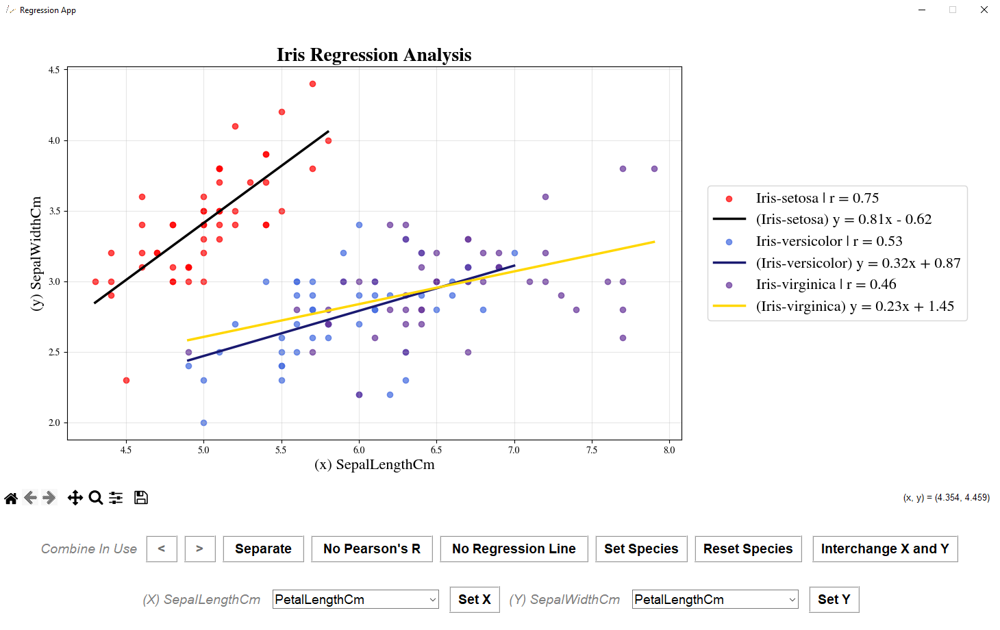
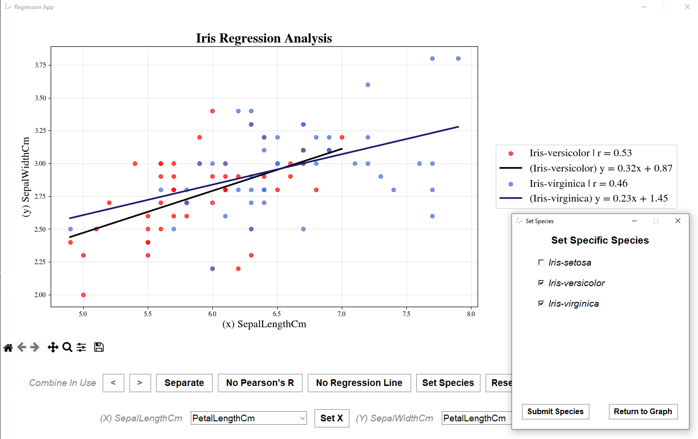
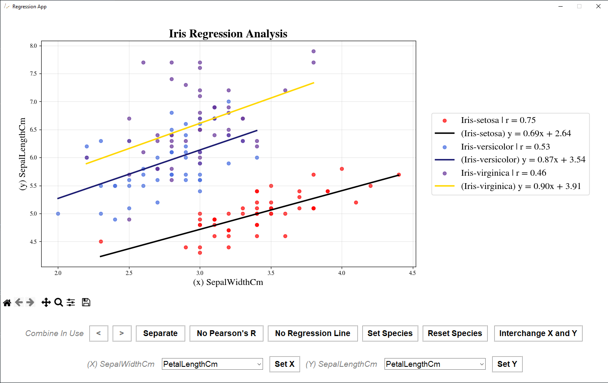

# Iris-Regression-Analysis
A modular Python application for multi-variable linear regression and correlation analysis, featuring dynamic data slicing and an interactive Tkinter UI.

# 📊 Multi-Dataset Linear Regression Tool
**Developed by a 17-year-old Python Developer | Focus on Data Science & UX**

An interactive, modular desktop application built to perform linear regression and correlation analysis on multi-class datasets.

---

## 📸 Interface Preview

### 1. Comprehensive Analysis View

*Displays multiple regression lines, equations ($y = mx + b$), and Pearson’s R values for selected species.*

### 2. Dynamic Data Filtering

*Features a custom checkbox system in a scrollable UI, allowing for $2^n - 1$ unique combinations of species selection.*

### 3. Axis Interchange & UX

*Instantly swap X and Y variables with a single click to re-analyze data relationships.*

---

## 🚀 Key Features

*   **Modular OOP Architecture:** Clean separation between the GUI (`RegressionApp.py`) and the mathematical logic (`linear_regression.py`).
*   **Multi-Dataset Support:** Includes pre-loaded datasets for **Classification Analysis** (`Iris.csv`) and **Simple Linear Regression** (`Study_Hours.csv`).
*   **Real-time Statistics:** Automated calculation of **Pearson’s Correlation (r)** and **Least-Squares Regression** lines.
*   **Robust Path Management:** Custom absolute pathing logic ensures the app runs flawlessly regardless of the user's local directory structure.

---

## 🛠️ Tech Stack
- **Language:** Python 3.x
- **Libraries:** Pandas, Matplotlib, NumPy, Tkinter
- **Logic:** Object-Oriented Programming (OOP)

## 📖 How to Run
1. Ensure you have the dependencies installed:
   `pip install pandas matplotlib numpy Pillow`
2. Run the main application:
   `python src/RegressionApp.py`

## 🧠 Technical Highlights: The $2^n - 1$ Logic

One of the core challenges of this project was managing species selection. For any given dataset with $n$ unique species, there are **$2^n - 1$** possible non-empty combinations.

- **The Problem:** A standard dropdown menu becomes unusable as $n$ grows (e.g., 5 species = 31 combinations, 10 species = 1,023 combinations).
- **The Solution:** I implemented a dynamic **Checkbox System** within a scrollable `Tkinter.Canvas`. This allows the user to intuitively build any combination they desire without the UI becoming overwhelmed by a massive list of pre-calculated options.
- **Data Integrity:** The filtering logic uses **Pandas `.isin()`** methods to ensure that only the selected subsets are passed to the regression engine, maintaining high performance even with large datasets.
